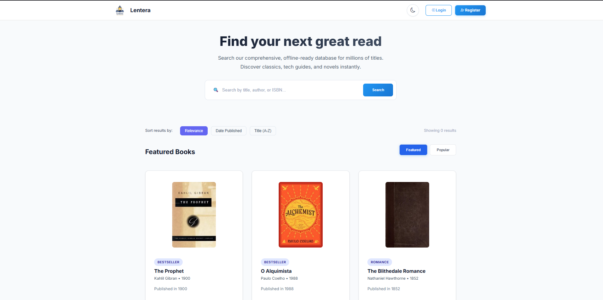
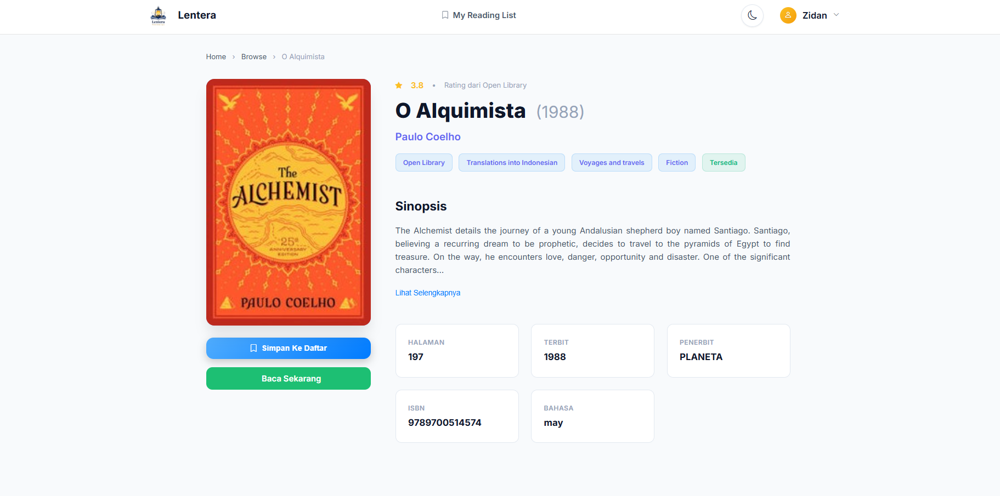
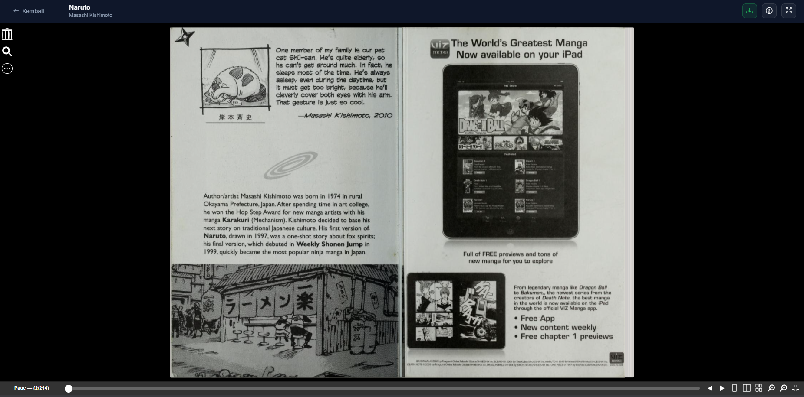
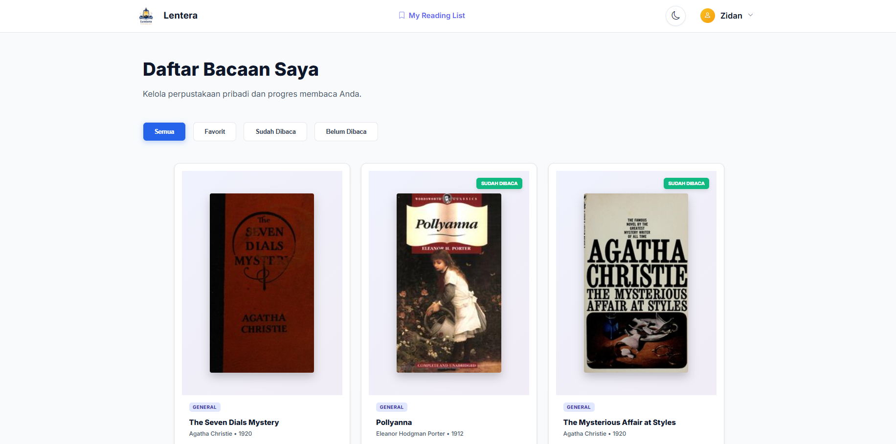

# Paradaya Lentera

> A book search application that leverages the OpenLibrary API to help users discover and explore books. Built as a capstone project for the Paradaya program, featuring modern React architecture and responsive design.

## 📱 Screenshots

### Home & Discovery

### Book Details

### Reading Experience

### My Reading List

## 🚀 Key Features

- **Book Discovery**: Seamless search integration with the OpenLibrary API to find millions of books.
- **Detailed Insights**: View comprehensive information about each book, including authors, descriptions, and cover art.
- **Reading List Management**: Keep track of books you want to read or are currently reading.
- **Responsive Experience**: A modern, mobile-friendly interface designed for users on the go.
